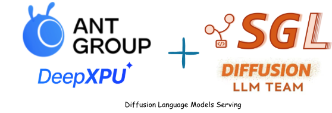
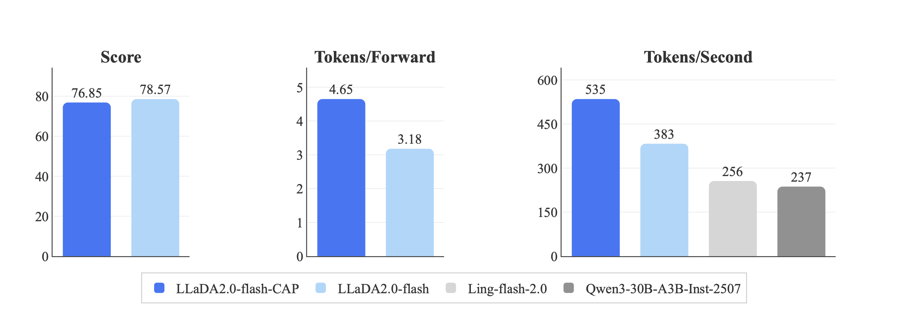

1. TLDR: 我们干了啥，有啥效果；

2. 技术背景：我们研究的事情是什么，为什么要做这件事情；这件事情的难点是什么；

3. 架构设计；可以有一些伪代码；

4. 实现效果；

5. 具体使用方法；用户如何安装 + 迁移 + 使用；

6. 未来计划；

7. 工程附录；（把实现起来很花了精力 + 学到了很多东西的地方简单分享下）


# Preview

<div align="center">
  
</div>

# TL;DR

这篇 Blog 展示了


# Background


Earlier this year, **LLaDA** made its debut as the **first Diffusion Language Model (DLM)**, immediately capturing significant attention from both the academic and industrial communities. This achievement, a collaboration between **Renmin University of China** and **Ant Group**, demonstrated that the unique execution paradigm of Diffusion models exhibits **superior data comprehension capabilities** and enables **faster inference speeds** compared to Auto-Regressive models. Furthermore, as we continued to scale up the size of our Diffusion models, the corresponding improvement in model performance reinforced our commitment to pursuing a path toward even larger models.

However, in the process of scaling up DLM parameters, **we** **encountered a series of serious engineering challenges**. Key among these were the critical hurdles of **model evaluation performance** and providing robust support for **Reinforcement Learning (RL) post-training**.

## Challenges

The current inference engines available for Diffusion models are **insufficient to support the evaluation and RL post-training requirements of larger-scale DLMs**. For instance, tools like **fast-dllm** are excellent research tools, better suited for algorithm researchers to tune and validate various Diffusion decoding algorithms. However, they fall short in providing **production-ready serving capabilities**, struggling to support crucial engineering needs such as **batching**, **scheduling**, **RL ecosystem integration**, and **parallelism**.

In contrast, **SGLang** is one of the most popular LLM inference engines today, boasting multiple advantages:

- **Production-Ready:** It has been deployed in inference services across thousands of companies, offering **mature and reliable engineering capabilities**.
- **Technological Lead:** SGLang itself incorporates a vast array of **excellent and advanced inference optimization techniques**, with a continuous flow of new optimizations emerging from the community.
- **Complete Ecosystem:** It integrates extremely well with the RL post-training ecosystem, particularly standing out in areas like **distributed weight GPU P2P updates**.

**However, the core issue is that SGLang currently only supports the Auto-Regressive calculation paradigm, and has not yet adapted to the Diffusion calculation method.**

Therefore, the challenge we face is: **How can we cleverly introduce support for the Diffusion Language Model within the existing SGLang framework without compromising its current architecture?** The goal is two-fold: allow DLMs to benefit from all the optimization advantages SGLang offers, while **avoiding major, compromising modifications** to the SGLang framework just to accommodate Diffusion computation.

# Design

### Key Insights:

Based on our observations of the current developments in DLM, we have identified several key insights:

- Due to the enormous computational cost of **Bidirectional Attention Diffusion** and its inefficient utilization of the KV Cache, mainstream Diffusion Language Models are increasingly moving toward the **Block-wise Diffusion** architecture.
- The computation pattern of **Block-wise Diffusion** bears a high degree of similarity to SGLang's existing **Chunked-Prefill** process.

### Design:

Our approach is to **cleverly leverage SGLang’s existing Chunked-Prefill pipeline** to implement computational support for **Block-wise Diffusion** models. This method allows us to seamlessly integrate DLM into the SGLang ecosystem **without changing the core SGLang framework**, enabling DLM to directly benefit from all the inference optimization techniques SGLang has accumulated.

#### Architecture:：


As illustrated in the diagram, our modifications to the SGLang framework are very restrained, barely touching its core. **SGLang's original** `**generate request**` **execution flow remains unchanged.** Our implementation primarily focuses on leveraging and modifying its existing **Chunked Prefill** mechanism, with the specific work concentrated on two critical components: the `**prefill adder**` and `**chunked reqs**`.

In SGLang, the initial purpose of Chunked Prefill was to maximize GPU utilization. Consequently, the size of a single chunk is typically set quite large—ranging from 2K to 16K tokens in sequence length, depending on the GPU model. When the sequence is long enough, it naturally processes **only one request**, which is how the current `prefill adder` and `chunked req` are implemented.

However, the decoding process for Diffusion models differs: it segments the sequence length at the **Block level**. Taking LLaDA-2 as an example, its Block Size is 32 tokens. If we were to follow SGLang's previous logic of 'processing only one large request at a time,' GPU performance would clearly be wasted. Therefore, **batching** is a crucial problem that must be solved. To achieve efficient batching, we modified both `**chunked reqs**` and the `**prefill adder**` to enable them to process multiple Diffusion Blocks within a single computation cycle.

Furthermore, at the actual decoding execution level, we **inserted an abstraction layer for the Diffusion algorithm** between the **TP Worker (Tensor Parallel worker)** and the **Model Runner (model executor)**.

Specifically:
- If the Worker identifies that it is handling a Diffusion model, the execution flow enters this dedicated branch.
- The TP Worker then calls the Diffusion algorithm's `**run**` function.
- Internally, this algorithm utilizes a **forward iteration loop** to continuously drive the Model Runner to perform inference computations until the **entire Block (e.g., all 32 tokens) is decoded.**

#### Casual Mask


The most significant difference between Block Diffusion and Chunk Prefill during a single **Model Forward Pass** lies in the handling of the **Attention Mask**.

- **Block Diffusion** utilizes a **Block-wise Causal Mask**.
- **Chunk Prefill for AR model** uses the traditional **Token-wise Causal Mask**.

We can view **Block Diffusion** as a **functional extension** to the existing Chunk Prefill mechanism within SGLang. Regarding the specific Attention calculation, a single forward pass involves two computational parts, whose final outputs are concatenated:

1. **Cache Query**: This uses the current Q_curr (the query vectors of the current block) to perform **Bidirectional Attention** against the existing **KV Cache**. **This computation is completely identical for both Block Diffusion and Chunk Prefill.** The objective here is to ensure the current block attends to all historical information.
2. **Intra-Block Query**: This uses the current Q_curr against its **own KV** (i.e., the keys and values within the current block) to perform the forward calculation.

- **Block Diffusion** employs **Bidirectional Attention** in this step.
- **Chunk Prefill** must use a **Causal Mask** in this step.

Simply put, if we visualize the attention mask as a geometric shape for the Q_curr portion:
- The calculation for **Chunk Prefill** (Causal Mask) corresponds to a **trapezoidal** (or triangular) mask.
- The calculation for **Block Diffusion** (Bidirectional Attention) corresponds to a **rectangular** mask.

## Streaming output animation


# How to Use

### Example Launch Command

```shell
python3 -m sglang.launch_server \
  --model-path inclusionAI/LLaDA2.0-mini \ # example HF/local path
  --dllm-algorithm LowConfidence \
  --dllm-algorithm-config ./config.yaml \ # Optional. Uses the algorithm's default if not set.
  --host 0.0.0.0 \
  --port 30000
```

### Example Client Code Snippet

Just like other supported models, diffusion language models can be used via the REST API or Python client.

Python client example for making a generation request to the launched server:

```python
import sglang as sgl

def main():
    llm = sgl.Engine(model_path="inclusionAI/LLaDA2.0-mini",
                     dllm_algorithm="LowConfidence",
                     max_running_requests=1,
                     trust_remote_code=True)

    prompts = [
        "<role>SYSTEM</role>detailed thinking off<|role_end|><role>HUMAN</role> Write a brief introduction of the great wall <|role_end|><role>ASSISTANT</role>"
    ]

    sampling_params = {
        "temperature": 0,
        "max_new_tokens": 1024,
    }

    outputs = llm.generate(prompts, sampling_params)
    print(outputs)

if __name__ == '__main__':
    main()
```

Curl example for making a generation request to the launched server:

```bash
curl -X POST "http://127.0.0.1:30000/generate" \
     -H "Content-Type: application/json" \
     -d '{
        "text": [
            "<role>SYSTEM</role>detailed thinking off<|role_end|><role>HUMAN</role> Write the number from 1 to 128 <|role_end|><role>ASSISTANT</role>",
            "<role>SYSTEM</role>detailed thinking off<|role_end|><role>HUMAN</role> Write a brief introduction of the great wall <|role_end|><role>ASSISTANT</role>"
        ],
        "stream": true,
        "sampling_params": {
            "temperature": 0,
            "max_new_tokens": 1024
        }
    }'
```

# Performance





# Industrial Practice


# Roadmap

### Implemented key features

The current implementation fully supports the following critical serving features:

- [x] **Block-wise Diffusion Framework** main logic
- [x] Full **KV Cache** support for sequence management
- [x] Model integration for **LLaDA-2.0-mini/flash**
- [x] Support for **Custom Decoding Strategies** (e.g., implementing **low-confidence policy**)
- [x] Full **Streaming I/O** capability
- [x] **Batching** support (leveraging SGLang's core scheduling)
- [x] **Tensor Parallelism (TP)** support
- [x] **CUDA Graph** optimization

### TODOs:

- [x] Model accuracy verification (WIP)
- [ ] Refactor core logic to better align with the original auto-regressive process.
- [x] Implement batching support utilizing CUDA graphs.
- [x] Integrate additional common diffusion decoding strategies/algorithms.

### Mid & Long-term Roadmaps

- [ ] Support overlap scheduling
- [ ] Support speculative decoding in diffusion language model
- [ ] Add compatibility for non-block-wise diffusuion models (e.g., LLaDA & RND1)
- [ ] Based on the latest mature diffusion algorithm to implement the dlm iteratively


# Appendix


# Reference


# Acknowledgements

- Ant Group DeepXPU Team:
- Ant Group Theta Team:
- SGLang dLLM Team: 
- Nvidia Fast-dllm Team: