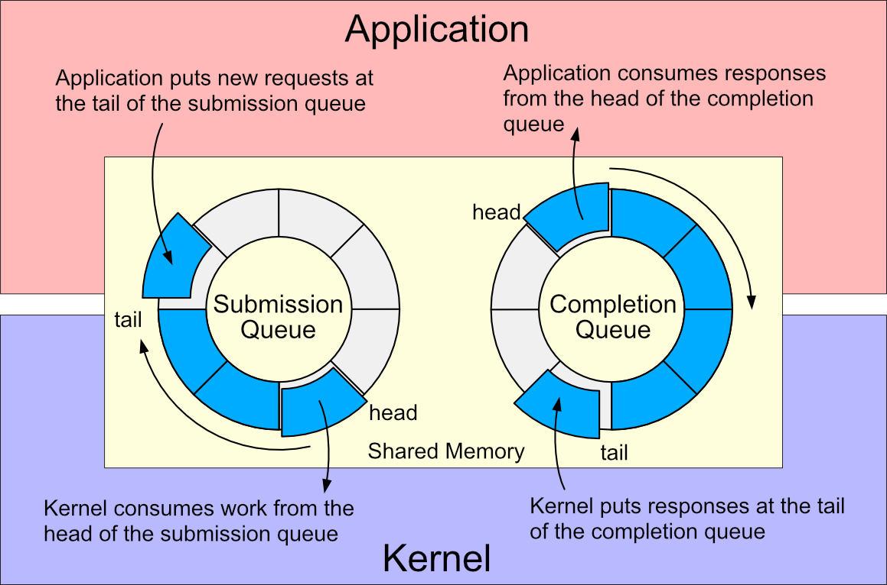
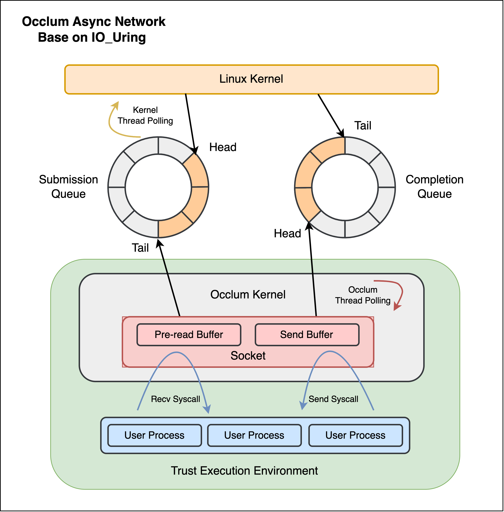
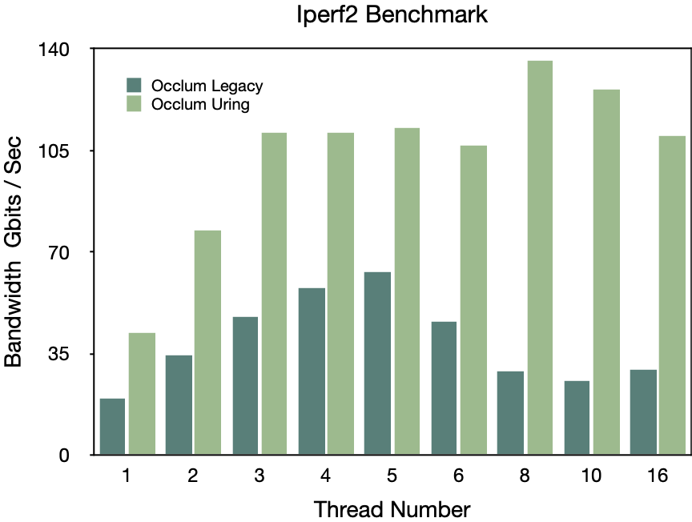

# Occlum 异步网络框架 （IO_Uring）
## 项目背景

Occlum 是蚂蚁集团自研的基于可信执行环境（TEE）的用户态操作系统，使得普通应用能够在不需进行任何改造的情况下获得机密计算的能力。SGX 硬件特性为应用提供了一个黑盒子般的可信执行环境，而 Occlum 在此环境中为应用提供了全面的操作系统级支持。

随着机密计算技术的应用场景不断扩大，从小型向大规模、高并发的分布式应用拓展，涵盖了分布式机器学习、大数据处理等多种领域。Occlum 目前已经能够支持包括 Spark、Flink、Redis 和 MySQL 在内的大数据生态软件，同时也对如 Cluster Serving 和 TensorFlow Serving 这类分布式推理服务提供支持，并能够处理如大语言模型推理、Pytorch 和 Tensorflow 分布式训练等当前最热门的应用需求。这些应用都有一个共同追求——可扩展性（Scalability）。但分布式应用的扩展能力往往受限于 IO 性能的制约。

然而，自设计之初，可信执行环境就有着 IO 性能瓶颈的问题。当应用执行 IO 操作时，需要保存可信执行环境内的上下文，切换到不可信区域，然后通过宿主机的操作系统来完成 IO 操作。这一过程不仅涉及额外的内存拷贝，而且上下文切换的开销会大幅影响应用的执行性能。根据我们的测试数据显示，在搭载 SGX2 的机器上，可信执行环境与不可信区域的上下文切换开销，是用户态与内核态切换开销的70倍！

因此，为这些分布式应用提供高性能的 IO 解决方案，成为 Occlum 迫切需要解决的技术难题。经过长时间的实验和论证，我们最终采用能够显著减少上下文切换开销的 IO_Uring 技术，作为提升 IO 性能的核心组件。我们在 IO_Uring 的基础上，设计并实现了一整套异步网络框架。这个框架不仅支持异步网络系统调用，还兼容传统的同步网络系统调用，意味着用户无需更改现有应用程序代码，便可直接享受到 IO_Uring 带来的性能提升。

## IO_Uring 介绍

IO_Uring 和 eBPF 是当前Linux最热门的两大功能。IO_Uring，作为一种现代的内核异步IO模型，不仅统一了存储IO与网络IO的API接口，还因其能显著减少上下文切换的开销，而被进一步拓展到更多系统调用。对于每个采用IO_Uring的应用来说，它们都会与内核共享一块特定的内存区域。在这块共享内存中，包含了两个环形缓冲区（Ring Buffer），用于应用与内核相互的通信：

- 提交队列（Submission Queue）：用户态应用通过提交队列向内核发送异步 IO 请求
- 完成队列（Completion Queue）：内核通过完成队列通知用户态应用的请求完成结果

通过这样的设计，IO_Uring 优化了传统异步 IO 处理流程，旨在提供一种更高效、更低延迟的异步 IO 操作方式。



上述图解揭示了两个环状队列构成的异步接口架构。这一接口使应用程序能够从传统的基于就绪（Readiness-based）的 I/O 模型转向新的基于完成（Completion-based）的模型，其中异步文件和网络 I/O 共享统一的API。通过这两块环状队列，IO_Uring 赋予了应用批量提交系统调用的能力，同时应用得以通过内核轮询（Kernel polling）模式提交 IO 请求，无需进行内核态和用户态的上下文切换。与此同时，IO_Uring 的共享内存映射机制也减少了IO数据在用户态和内核态间内存拷贝的开销。

从设计哲学上来看，IO_Uring 作为一种网络旁路（Kernel bypass）技术，其性能优势相对于传统的网络系统调用是显而易见的。它能通过绕过系统调用的方式，大幅提升数据处理速度。在网络旁路技术的领域中，DPDK（Data Plane Development Kit）无疑代表着技术的尖端，它通过零中断、零拷贝和轮询驱动等高性能特性大幅提升网络数据包的处理效率。然而，DPDK的缺陷也是明显的：它不能无缝整合内核的文件系统，需要投入额外的开发资源以适配特定应用场景，并且由于DPDK对网卡设备的独占性，它的可扩展性和易用性都不及IO_Uring。

总而言之，IO_Uring 提供了一种更加灵活且高性能的异步网络实现方案，IO_Uring的设计思路允许它以一种更加用户友好的方式被广泛应用，而不必牺牲扩展性与可用性。这种平衡了性能与兼容性的特性，是我们最终选用 IO_Uring 作为核心开发组件的根本原因。


## 异步网络架构

如图所示，用户进程通过 Occlum 运行在可信执行环境内，Occlum 内核向用户进程提供了包括系统调用在内的各种服务。同时 Occlum 会在不可信内存区域创建 IO_Uring 实例，Occlum 内核通过这块已经映射的共享内存与宿主机内核进行 IO 通讯。Occlum 会在 Enclave 内部处理用户发送的系统调用，提供基础网络功能，而如数据包的接受和发送这部分网络协议栈和驱动层的工作，则通过 IO_Uring 传递给宿主机来处理的。

Occlum 能够直接在不可信区域的共享内存上进行读写操作，无需在Enclave内外进行额外的上下文切换。因此，当Occlum向IO_Uring提交队列中添加提交队列项（SQE）并不需要额外的切换开销。另一方面，我们会在启用 IO_Uring 的同时设置 IORING_SETUP_SQPOLL 标志位，这个标志位能够让 Linux 内核启用一个内核线程不断地轮询提交队列，这意味着 SQE 从写入提交队列到被宿主机 Linux 内核接收，不需要经过用户态和内核态的切换开销。而在Occlum 原有的网络实现中，应用需要经过 Enclave 内/外和用户态/内核态的两次上下文切换开销，才能完整提交一个网络系统调用。



### 同步难题

在 Occlum 现有的网络实现架构中，用户线程与 Occlum 内执行的Enclave线程之间基本保持1：1的映射关系。一旦应用程序调用了 Occlum 提供的网络系统调用，它就会转入Occlum内核的执行流中，并从 Occlum 内核切换到不可信环境的宿主机环境来执行相应的网络系统调用。以发送操作（Send）为例，Occlum会通过一个 Ocall 的机制切换至不可信区域的宿主机用户态，随后调用 Send 系统调用进入宿主机的内核态。当 Send 操作完成后，执行流会从宿主机内核态回到用户态，然后回到Occlum环境（从Ocall返回至Enclave），至此，整个IO操作结束。这一过程是完全同步执行的。

但是，当 Occlum 集成了 IO_Uring 后，它如何能够异步地提供同步执行流的体验呢？当 Occlum 通过IO_Uring 共享内存提交 IO 请求后，它不能立即告知应用 IO 操作的完成结果，而需要等待宿主机内核完成该 IO 请求。一个直观的解决方案是，相关线程进行自旋（Spin），直到收到完成队列项（CQE），这样在IO操作完成时才返回。然而，这种方法会导致过高的CPU资源消耗。另外一种解决方案是让该线程休眠（Park），等待CQE，并由监测 CQ 的轮询线程在适当的时候唤醒（Unpark）它。这种方式虽然可以解决CPU资源消耗的问题，但由于 Park 和 Unpark 操作都涉及Ocall，因此会带来其他性能损失。

有读者可能会提出，为什么不考虑利用异步协程来实现运行时？通过这种方式，内核线程仍作为真实线程存在，用户线程则通过协程实现，这样不仅避免了额外的CPU开销，同时休眠用户线程（协程）的成本也很低。实际上，我们确实尝试过这一大胆的方案，并利用 Rust 语言的无栈协程来实现Occlum异步运行时。但是，由于无栈协程的固有特性，即便我们进行了大量的优化，复杂场景下的用户进程仍难以达到理想的性能表现。这一问题，我会在未来的文章中详细解释。

最终，我们不得不采取了一种折衷的方法，结合自旋（Spin）和休眠（Park）机制。我们首先进行自旋等待，以处理能够迅速完成的IO操作；如果 IO 操作预计会有更长的等待时间，我们则会转而休眠线程，此时休眠的开销可以被长时间的等待所抵消。这种方法引入的额外开销主要是唤醒（Unpark）操作。同时，我们也通过实施异步写入（Async Write）和预读（Pre Read）的策略，以尽可能减少内核线程在等待IO操作时的空闲时间。

### 异步写入 Async Write

当Socket被创建时，Occlum 内核会利用 Mmap Ocall 技术为 Socket 分配两块位于不可信区域的缓冲区（Untrusted Buffer），用于存储即将发送和接收的数据。其中一块缓冲区被用作异步写入的环形缓冲区，我们称之为发送缓冲区（Send Buffer）。当用户进程通过 Occlum 的 Sendmsg 系统调用发起数据发送请求时，它实际上是将待发送数据写入到 Send Buffer 中。一旦数据成功写入这块缓冲区，就视作数据发送操作完成，随即将写入的数据长度作为结果返回给用户。

对此，读者可能会产生两个疑问：
首先，如果仅仅是将数据写入到缓冲区就认为发送成功，但实际数据并未真正发送出去，这不会造成状态不一致吗？实际上，在Linux中，当用户数据被写入到Socket的发送内核缓冲区（Socket Send Kernel Buffer）后，系统同样会立即返回发送成功的反馈给用户。我们的异步网络架构紧密模仿了Linux内核的行为模式，并不会引发状态不一致的问题。
其次，如果Send Buffer中的数据已满怎么办？对于阻塞（Blocking）型网络操作，我们采用先自旋（Spin），再休眠（Park）的策略。而对于非阻塞（Non-blocking）型操作，我们会返回一个EAGAIN错误。

在宿主机内核中，若没有对应该 Socket 的发送操作（Send Op）排队，Occlum 内核会在数据填充到 Send Buffer 后，推送一个新的 Send Op到 IO_Uring 中去。此外，当一个 Send Op 作为完成队列项（CQE）返回后，如果 CQ 的轮询线程检测到对应Socket的Send Buffer内还有未发送的数据，它会再次向IO_Uring推送一个新的Send Op，以发送这些剩余的数据。这一机制确保了即使在异步环境下，数据的发送仍然可以保持连续和完整。

### 预读 Pre Read

在 Socket 被创建的同时，会有一块分配在不可信区域的缓冲区专门用于预读操作，我们将其称之为接收缓冲区（Recv Buffer）。随着 Socket 的创建，一个接收消息的操作（Recv SQE）也会被推送至 IO_Uring 提交队列中。这个预读动作的目的是为了在用户尝试读取数据之前，已经将宿主机内核中的数据预先读入到 Recv Buffer 中去。因此，当用户通过 Occlum 的系统调用访问这部分数据时，系统可以立即返回成功结果。对于用户发起的阻塞读操作，在Recv Buffer中没有可读数据时，处理流程会先进行一段时间的自旋，随后若数据依旧不可用则进入休眠状态，等待接收操作的完成通知。

完成接收操作后，即当 Recv Op 作为完成队列项（CQE）返回时，如果 CQ 轮询线程注意到对应 Socket 的 Recv Buffer 还有剩余空间，它将再次向 IO_Uring 提交一个Recv Op，以填充该部分空间的数据。这种策略确保了即使在高并发的情况下，系统能够有效地处理接收操作，优化数据的实时读取效率。

## 性能评估

该性能指标都是在阿里云 32 核的弹性计算实例上测试结果。和我们预期一致，在异步网络传输中，在极少数的情况下才会触发休眠和唤醒的性能开销，传输性能相较于 Occlum 原有的网络实现提升了一倍以上。在同步传输中，出乎意料的性能仍然不错，网络传输性能也至少提升了百分之几十。

### Iperf3

Iperf3 是单线程非阻塞的网络传输测试。另外，考虑到使用多 IO_uring 实例在 Iperf3 场景中会占用过多的系统资源，与传统的系统调用相比并不公平。因此，Iperf3 性能测试中我们仅使用了一个 IO_Uring 实例。

```
            | occlum legacy |    ngo    | occlum uring
Mbytes/sec	    2641.5	       4392.5      4926.18
						        (+86.5% / +12.1%)

(compare to original occlum ~2200 Mbytes/sec ~ +123% )
```


### Iperf2

Iperf2 是多线程阻塞的网络传输测试，可以测试TCP/UDP等等。考虑到TCP协议使用更广泛，测试以TCP协议作为基准。




## 局限性

IO_Uring 的最显著限制可能在于其对 CPU 资源的占用。正如论文[《Understanding modern storage APIs: a systematic study of libaio, SPDK, and io_uring》](https://dl.acm.org/doi/abs/10.1145/3534056.3534945)所分析的那样，IO_Uring 仅在开启内核轮询（Kernel Polling）功能时，才能实现与 SPDK 等 Kernel Bypass 技术相媲美的高性能。然而，开启内核轮询会导致内核线程占用大量的CPU资源，这在CPU资源有限的环境下可能会对应用程序的运行性能产生负面影响。

在我们的实践中，我们不仅为每个 IO_Uring 实例启用了一个内核轮询线程，还增设了一个用户态的完成队列轮询线程。更为关键的是，我们注意到单个 IO_Uring 实例有时无法充分利用宿主机的网络带宽上限，通常需要更多的实例来增强性能，比如使用四个 IO_Uring 实例。这意味着，要想充分启用Occlum的异步网络框架以追求高性能IO处理，前提是系统必须拥有富余的CPU核心资源。因此，在考虑采用 IO_Uring 作为异步网络解决方案时，必须在性能提升和CPU资源之间做出权衡，特别是在那些CPU资源紧张的环境中，这种权衡尤为重要。

## 后续工作

在现有的框架之上，确实存在一些潜在的改进空间，通过以下几个策略，我们可以进一步提升性能：
- 设计 Provided Buffer 管理器，利用 IO_Uring 的 Provided Buffer 功能，提前将 Socket 所对应的 Buffer 映射到共享内存中，以此减少内存映射（mmap）和解映射（munmap）带来的性能开销。
- 实现 IO_Uring 的零拷贝 Sendmsg 功能，从而降低数据载荷在内存中复制的开销。
- 利用 IO_Uring 的 Multi-shot Recvmsg特性，以减少反复提交 Recvmsg 请求的消耗。
- 应用 IO_Uring 的 ATTACH_WQ 选项来优化内核轮询线程的 CPU 使用率。
- 利用 IO_Uring 的 POLL_FAST 标志等参数来进一步优化网络性能。

除此之外，还有一些更为创新的想法值得探索。例如，在阻塞IO场景中，由于 Park / Unpark 操作耗费较大，我们可以考虑使用 IO_Uring 来推送Write_eventfd操作，以加快Unpark操作的执行速度。另一种思路是，利用IO_Uring的Linked Op特性将Write_eventfd操作链接到其他操作上，这样可以使得当某些操作完成时，IO_Uring能够直接在内核中唤醒因这些操作而阻塞的线程。

通过这些方法，我们不仅能够提高IO操作的效率，还有可能减少CPU资源的消耗，从而在保持高性能的同时，实现更加高效的资源利用。

## 总结

当前采用 IO_Uring 技术构建的异步网络框架，大幅度地提升了Occlum的IO性能。这套框架不仅支持异步和同步系统调用，还能确保用户在毫无察觉的情况下受益于 IO_Uring 所带来的显著IO性能提升。

## 引用

- https://lwn.net/Articles/815491/
- https://unixism.net/loti/index.html#
- https://dl.acm.org/doi/abs/10.1145/3534056.3534945
- https://github.com/axboe/liburing/wiki/io_uring-and-networking-in-2023
- https://developers.redhat.com/articles/2023/04/12/why-you-should-use-iouring-network-io
- https://man7.org/linux/man-pages/man3/io_uring_prep_recv_multishot.3.html
- https://dl.acm.org/doi/abs/10.1145/3534056.3534945