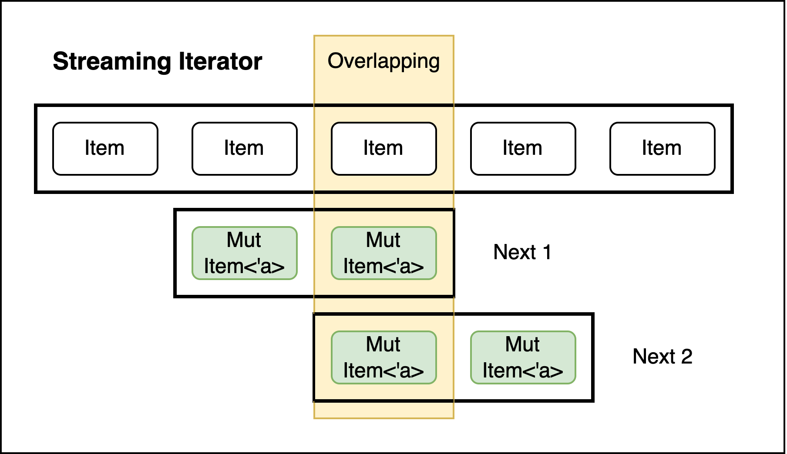

# Rust 高阶类型 HKT
## 什么是高阶类型 HKT (Higher Ranked Types)
对于Rust这类强类型的语言，每一个表达式都是一个类型（types）。而其中最基础的类型则是 `u32, bool, char` 等，这种类型我们统称为具体类型（concrete types）。而与之相对的，则是  `function` 这类操作类型的类型，如：
```rust
fn not(x: bool) -> bool { !x }
```
其中，`not` 这个函数的类型就是 `bool -> bool`。像描述的函数与基本类型，我们认为他们的阶（kind）都是type。<br />而更高阶的类型有比如`Box<T>`，从阶的角度来讲，它并不是一个 type 类型，它需要被赋予一个 type 类型才能成为一个新的type 类型，我们把`Box<T>`这类阶是 `type -> type`的类型称为**类型构造器** （Type constructor）。
```latex
expression |  kind
-------------------
i32        |  type
i32 -> i32 |  type
Box<i32>   |  type
Box        |  type -> type
```
像类型构造器这种`type -> type` 就是我们所说的高阶类型，这类高阶类型可以很容易通过泛型实现。<br />当然，也存在有更高阶的类型。如果我们想要实现一个更高层次的抽象，比如想要实现一个智能指针的抽象`Pointer<_>`，他内部指向的一个i32的指针，但至于这个内部具体实现的指针是`Box`、`Arc` 或者 `Rc` ，交由开发者去指定。这个`Pointer<_>`也是个高阶类型，不过他的泛型是类型构造器。
```latex
expression          |  kind
-------------------------------------------
Box<i32>            |  type
Box                 |  type -> type
Pointer             |  (type->type) -> type
Pointer<Box<_>>     |  type -> type
```
但很遗憾，在rust中很难实现`Pointer<_>`这类高阶类型。原因很简单，**在rust中只支持type和生命周期作为泛型**，类型构造器无法作为`Pointer<_>`这类高阶类型的泛型。想要实现`Pointer<_>`这类高阶类型，我们需要使用一个比较tricky的方法，泛型关联类型（Generic associated types）。
## 什么是泛型关联类型 GAT (Generic Associated Types)
泛型关联类型最早是在2016年一篇[Rust RFC](https://rust-lang.github.io/rfcs/1598-generic_associated_types.html)中提出的。直到2022年十一月份才被合入stable的[Rust 1.65.0](https://blog.rust-lang.org/2022/11/03/Rust-1.65.0.html)版本。<br />这是一个非常简单易用的feature，能够让trait的关联类型定义为泛型。如原文所述：
> Lifetime, type, and const generics can now be defined on associated types.

Annoucing blog 中也给出了简单的例子，如：
```rust
trait Foo {
    type Bar<'x>;
}
```
简而言之，GAT这个新feature能够允许trait里面的关联类型成为类型构造器。
## 如何利用GAT构造HKT
尽管我们有了GAT，但也并不能直接的构造出一个高阶类型。一层不够，我们就用两层来构造！由于Rust是个强类型的语言，我们需要一个中间结构表示类型构造器。这里我们需要用上`family`这个pattern来编码高阶类型。<br />比如我们使用 `PointerFamily`  trait 来表达来表达包含`Box`、`Arc` 和 `Rc` 的抽象。使用 `Pointer<T>`作为类型构造器。
```rust
trait PointerFamily {
    type Pointer<T>: Deref<Target = T>;
    fn new<T>(value: T) -> Self::Pointer<T>;
}
```
然后构造第二层结构，来表示符合`PointerFamily`  trait 的 `Arc` 族，比如我们命名  `ArcFamily` 表示 `Arc<T>`这一类泛型。
```rust
struct ArcFamily;

impl PointerFamily for ArcFamily {
    type Pointer<T> = Arc<T>;
    fn new<T>(value: T) -> Self::Pointer<T> {
        Arc::new(value)
    }
}

struct RcFamily;

impl PointerFamily for RcFamily {
    type Pointer<T> = Rc<T>;
    fn new<T>(value: T) -> Self::Pointer<T> {
        Rc::new(value)
    }
}
```
最后我们就可以通过 `PointerFamily`  trait 作为泛型的Bound。现在我们就可以很方便的在struct 中使用满足 `PointerFamily` 的高阶类型。在 Intrusive-rs crate中对此有很好的应用，因为侵入式链表中 Node 指向下一个Node Link的指针就是`PointerFamily`，在使用侵入式链表时，使用什么样的智能指针就需要开发者指定。
```rust
struct Foo<P: PointerFamily> { 
    bar: P::Pointer<String>, 
}
```
这里通过Family进行两层构造的方法不太容易理解，笔者认为，高阶类型必须要使用或者包含泛型，但由于Rust泛型只能使用 `type` 和生命周期 这一阶的`kind`，所以我们需要将`PointerFamily` 这个高阶类型转换为具体的类型（concrete type），也就是 `type` 这一阶的`kind`，才能够模拟出 高阶类型的泛型。<br />如果只是想简单的了解Rust HKT，阅读到这已经足够了。但如果想要学习稍微复杂且更易用一些的Use Case，请继续往后阅读。
## 聊聊更常见的Use Case
其实`(type->type) -> type` 这一阶或者更高阶的类型，并不算常见。但 Rust 支持 GAT / HKT的主要目的其实是源于Rust特殊的生命周期的泛型机制。<br />由于Rust中将生命周期作为一种泛型，非常容易存在 `Item<'a>` 这类 `type -> type` 这阶的类型，而我们也需要将这种类型构造器作为泛型，一个比较容易理解的例子是 RFC 中提供的 `StreamingIterator`：
```rust
trait StreamingIterator {
    type Item<'a>;
    fn next<'a>(&'a mut self) -> Option<Self::Item<'a>>;
}
```
以 `StreamingIterator` 为例，它允许迭代器每次能够产生一个 **重叠且可变** （overlapping and mutable） 的 slice，如下图所示：



对于常规的迭代器trait，并不能为 `StreamingIterator` 提供比较好的实现方式，因为常规迭代器trait只能将生命周期绑定到整个Slice上。而如果仅仅让Item绑定整个Slice的生命周期，可能会在同一时间存在指向同一个 Slice 元素的两个可变引用，显然无法通过Rust 编译。而使用了GAT的`StreamingIterator`能够用将生命周期绑定到每一次调用Next产生的借用上，规避掉这个问题。<br />简而言之，`StreamingIterator` 能够使用**绑定了局部借用的生命周期**的类型。
> Defining traits which yield types which have a lifetime tied to the local borrowing of the receiver type.

## 参考

- [https://rust-lang.github.io/rfcs/1598-generic_associated_types.html](https://rust-lang.github.io/rfcs/1598-generic_associated_types.html)
- [https://blog.rust-lang.org/2022/11/03/Rust-1.65.0.html](https://blog.rust-lang.org/2022/11/03/Rust-1.65.0.html)
- [https://github.com/pretzelhammer/rust-blog/blob/master/posts/tour-of-rusts-standard-library-traits.md](https://github.com/pretzelhammer/rust-blog/blob/master/posts/tour-of-rusts-standard-library-traits.md)
- [https://github.com/PhotonQuantum/magic-in-ten-mins-rs/blob/master/src/HKT.md](https://github.com/PhotonQuantum/magic-in-ten-mins-rs/blob/master/src/HKT.md)
- [https://zhuanlan.zhihu.com/p/29021140](https://zhuanlan.zhihu.com/p/29021140)
