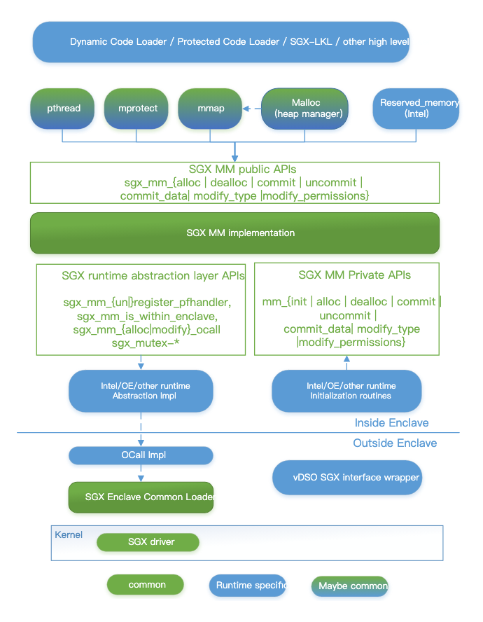
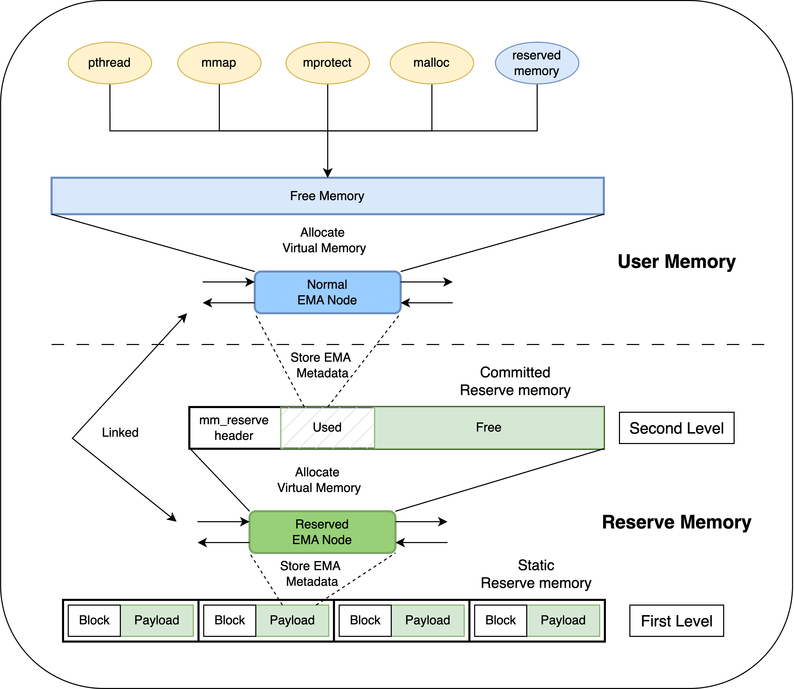
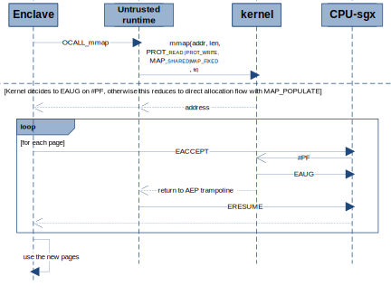

# SGX SDK 动态内存管理

## 整体架构

EMM内存管理模块是Intel SGX SDK中重要的子模块之一，它适配了Intel SGX新发布的EDMM动态内存管理硬件特性。EMM是Enclave Memory Management的简称，其中Enclave Memory指EPC（Enclave Page Cache，RAM中的一块特殊区域，用于提供给Intel Enclave受保护的机密内存）。EMM模块的职责包括动态分配与管理虚拟内存、将虚拟内存映射到物理页、更改EPC页类型与权限、缩减EPC内存等功能。对于开发者而言，EMM模块向上提供了一系列Enclave内存管理相关的API。对于系统而言，EMM模块在内存管理方面负责了可信运行时trts与不可信运行时urts及操作系统之间的交互，并抽象出内存管理流程。



该架构图源自于EMM设计文档。其中，EMM抽象出内存管理流，并为更高级别的SDK（如Intel SGX SDK、Rust SGX SDK和Open Enclave等）提供共享API以管理内存，支持这些SDK的可信运行时（trts）以动态内存管理重构系统调用（如pthread、mprotect、mmap和malloc）。要将EMM移植到这些SDK中，SDK开发者需要实现EMM内的运行时抽象层接口，包括注册页异常处理程序、虚拟内存分配ocall和互斥锁等。EMM通过页异常处理程序（#PF hander）与驱动程序进行交互，使用CPU指令（如eaccept、eaug、emode和eacceptcopy等）动态扩展内存。
其中，EMM架构的两个最关键和复杂的部分是内存管理设计和异常处理过程。

## EMM Arch

类比页表的多级内存管理，为了避免内存索引元数据占用过多内存空间，SGX内存管理也采用了分级内存管理的设计模式。

### EMA 链表

在介绍分级内存管理之前，必须先了解EMM模块中管理内存的内部结构EMA（Enclave Memory Area）。

```c
struct ema_t_
{
    size_t start_addr;  // starting address, should be on a page boundary
    size_t size;        // bytes
    uint32_t
        alloc_flags;    // EMA_RESERVED, EMA_COMMIT_NOW, EMA_COMMIT_ON_DEMAND,
                        // OR'ed with EMA_SYSTEM, EMA_GROWSDOWN, ENA_GROWSUP
    uint64_t si_flags;  // one of EMA_PROT_NONE, READ, READ_WRITE, READ_EXEC,
                        // READ_WRITE_EXEC Or'd with one of EMA_PAGE_TYPE_REG,
                        // EMA_PAGE_TYPE_TCS, EMA_PAGE_TYPE_TRIM
    bit_array*
        eaccept_map;    // bitmap for EACCEPT status, bit 0 in eaccept_map[0] for
                        // the page at start address bit i in eaccept_map[j] for
                        // page at start_address+(i+j<<3)<<12
    sgx_enclave_fault_handler_t
        handler;  		// custom PF handler  (for EACCEPTCOPY use)
    void* priv;   		// private data for handler
    ema_t* next;  		// next in doubly linked list
    ema_t* prev;  		// prev in doubly linked list
};

```

每个EMA节点对应着一个从操作系统分配的虚拟内存块，该内存块可以根据具体使用方式来决定是否真实地映射到物理页。EMM模块通过维护一个侵入式的双向链表来管理和操作这些在enclave address space (ELRANGE)内动态分配的虚拟内存块。每个EMA节点存储了Enclave虚拟内存的地址、大小、操作权限以及与SGX相关的类型、标识、位图、异常处理句柄等元数据。EMA节点本身并不知道具体的内存用途，但在EMM模块开发过程中，它们被分为两类：Normal EMA节点和Reserve EMA节点。这两类EMA节点都在同一个双向链表内，但它们的使用方式与元数据存储方式不同。Normal EMA节点维护了向上提供User Memory的内存块，而Reserve EMA节点则维护了内部Reserve Memory的内存块。

### 分级内存



上图直观展地展示了在EMM模块内部的内存分配方式。在第一层，EMM模块有一组静态分配的数组，用于存储Reserved EMA节点的元数据。第二层中，Reserved EMA节点管理EMM模块中的预留内存（Reserve Memory），该预留内存是通过调用`sgx_mm_alloc_ocall()`向操作系统申请分配，同时将虚拟内存映射到对应的物理页，用于存储Normal EMA节点的元数据。当EMM模块内的预留内存低于阈值时，会动态增加预留内存。在第三层，Normal EMA节点管理EMM模块中提供给上层的用户内存（User Memory），为SDK系统调用`pthread`、`malloc`、`mprotect`、`malloc`与SDK 预留内存`user reserved memory`提供统一的内存管理API。

通过内存分级管理设计，可以避免管理内存的EMA元数据占用过多的内存。当前的设计能够通过2KB的静态reserve内存，向用户提供7.2TB的内存空间。例如，每个EMA占用128 bytes，能够tracking最大为128个页大小的内存，即512KB内存。以管理1TB的内存为例，需要用到256MB的元数据，在静态内存中分配256MB内存是冗余且不能接受的。但是，通过分级内存管理，使用16个page大小的静态reserve内存，大概能够追踪1.75GB的动态申请的预留内存（committed reserve memory），能够向上提供约7.2TB的内存空间

## EMM API

以下提供的API都是在内存管理流中公开的，供上层应用程序用于管理内存。为了读者更轻松地阅读本章节，我们先对必要的SGX CPU指令进行简要介绍。

| 指令 | 功能 | 调用者 |
| --- | --- | --- |
| EAUG | 为已初始化好的 enclave 增加新的内存页 | Driver |
| EMODPR | 在运行过程中缩小 EPC 页的权限 | Driver |
| EMODT | 在运行过程中修改 EPC 页的类型 | Driver |
| EACCEPT | 验证 driver 对 EPC 页的动态修改 | EMM |
| EACCEPTCOPY | 验证 driver 为 enclave 新增加的 EPC 页并拷贝指定内容 | EMM |
| EMODPE | 在运行过程中拓展 EPC 页的权限 | EMM |

在EDMM中，最为核心和关键的是，大部分的内存操作过程都是由EMM在Enclave内部主导，通过Driver直接调用SGX指令，或者通过缺页异常（#PF）来调用Driver SGX指令。最终，EMM模块会直接或间接地（通过#PF）接收和验证Driver对EPC页的动态修改，从而让上层用户无感知Driver的交互与SGX指令的调用过程。

### PF Handler

在SDK移植EMM模块时，需要提供一个注册内存管理模块的page fault handler的函数，这是EMM模块在动态管理Enclave内存中与操作系统交互的关键。

```c
bool sgx_mm_register_pfhandler(sgx_mm_pfhandler_t pfhandler);
```

在EMM模块初始化时，会优先注册一个#PF handler。这是一个默认的#PF handler，当触发内存Page Fault时，如果用户没有设置该内存区域对应的#PF handler，会调用这个默认句柄。该句柄会根据虚拟页对应的EMA属性，选择合适的处理方式，例如在COMMIT_ON_DEMAND的EMA节点中调用`do_committed()`等。在后续内存管理流程的描述中，会详细介绍默认#PF handler在不同场景中的功能。

### 分配内存

`sgx_mm_alloc()`函数用于分配内存，可以在调用过程中为指定内存注册定制化的#PF handler。该API有以下三种不同的分配方式：

#### SGX_EMA_RESERVE

如果在标志位中设置了SGX_EMA_RESERVE，EMM模块并不会通过ocall真正地分配内存，而是预留一块入参指定的虚拟内存区域（address range）。如果成功申请内存，此次预留内存区域与相关信息会被记录在一个EMA节点上。在解除分配（dealloc）之前，所有对该区域内存的二次分配（alloc）都将返回错误。

有了SGX_EMA_RESERVE这种分配内存方式之后，上层应用程序能够快速地预留内存，无需切换Enclave上下文，更加灵活地选择将虚拟内存映射到EPC物理页的时机。

#### SGX_EMA_COMMIT_NOW

EMM模块会通过`sgx_mm_alloc_ocall() `函数，在urts侧通过mmap分配与Driver共同访问的共享内存。之后类比`sgx_mm_commit()`函数，**主动地**映射EPC页。

在当前in-tree的intel SDK版本中，sgx_mm_alloc_ocall()函数中虽然有alloc_flags与si_flags入参，但实际上并不使用。本质上仅调用mmap函数。因为Driver也要访问这块共享内存区域并且指定了具体地址，所以标志位入参设置了MAP_SHARED | MAP_FIXED。而新增的物理页需要有读写权限，属性入参则设置了PROT_WRITE | PROT_READ。

#### SGX_EMA_COMMIT_ON_DEMAND 

SGX_EMA_COMMIT_ON_DEMAND是按需将虚拟内存映射到EPC物理页的方式。沿用Linux内存管理按需分配的思路，能够提高EPC内存利用率，降低不必要内存分配的开销，也能避免内存碎片问题，提高系统性能。

EMM模块会通过`sgx_mm_alloc_ocall()`函数，在urts侧通过mmap分配与Driver共同访问的共享内存。在下一次访问该内存区域时，**被动地**通过#PF将虚拟内存映射到物理内存。下一次访问过程按需增加EPC页如图所示。首次访问时发现指向的虚拟页地址没有对应的PTE项，触发#PF handler通过driver调用EAUG指令，动态添加EPC物理页。然后返回EMM模块，继续第二次内存访问。此次发现对应EPC页有Pending标志位，并没有被EACCEPT。此时会触发EMM模块在初始化时注册的#PF handler，即`sgx_mm_enclave_pfhandler()`，在对应EPC页调用EACCEPT指令，接收该页。之后再次返回EMM模块，继续第二次内存访问，此次访问成功。



在当前in-tree的intel SDK版本中，`sgx_mm_alloc_ocall()`函数中虽然有alloc_flags与si_flags入参，但实际上并不使用。本质上仅调用mmap函数。因为Driver也要访问这块共享内存区域并且指定了具体地址，所以标志位入参设置了MAP_SHARED | MAP_FIXED。新增的物理页需要有读写权限，属性入参则设置了PROT_WRITE | PROT_READ。

### 释放内存

`sgx_mm_dealloc()`函数主要用于释放对应不同flags的内存区域。对于不同flags的内存：

- SGX_EMA_RESERVE：因为reserve内存空间并未调用ocall，仅需在内部EMA链表清掉指定地址区域（Address Range）
- SGX_EMA_COMMIT_NOW与SGX_EMA_COMMIT_ON_DEMAND：仅释放已经映射的EPC页，类比`sgx_mm_uncommit(）`。

在处理完内存区域之后，根据内存区域标志按需分割或合并EMA节点。

### 删除EPC页

`sgx_mm_uncommit()`函数用于主动删除EPC页。
因为SGX Page的TRIM操作需要对应EPC页具有读权限，所以会检查对应EMA节点的权限是否具有读权限。如果没有，会通过`ema_modify_permissions()`置上读权限，该函数类比修改权限`sgx_mm_modify_permissions()`。
然后会对已映射的EPC页区域调用`sgx_mm_modify_ocall()`，通过driver将页类型标记为PT_TRIM。之后再调用EACCEPT指令接收已经修改的EPC页，最后调用`sgx_mm_modify_ocall()` 函数通知 urts 已经完成EACCEPT操作，urts会将该EPC页解绑并清除。

### 映射EPC页

`sgx_mm_commit()`函数用于主动映射EPC页，要求映射的内存已经在之前被分配过。
EMM模块通过自身内部函数`ema_do_commit()`，对EPC页依次调用EACCEPT指令。由于指向的虚拟页地址没有映射物理页，硬件会触发#PF handler，通过driver调用EAUG指令动态添加EPC物理页。随后回到EMM模块，继续进行EACCEPT接收已映射的EPC页。

注意：EAUG与EACCEPT都是对一块内存按页逐一操作的，有不小的运行时性能开销。在使用方式上，这种动态分配方式主要用于上层动态分配堆内存与预留内存（heap mem / reserved mem）。

### 修改内存类型

`sgx_mm_modify_type()`函数用于修改EPC页类型，目前只能用于将EPC页改变PT_TCS类型。
首先，该函数会检查：

1. 对应内存是否已经映射EPC页。
2. EPC页类型是PT_REG
3. 入参改变的类型是PT_TCS

如果有不满足条件的，将会报错。之后，该函数会通过`sgx_mm_modify_ocall()`函数，主动让driver将EPC页类型从PT_REG修改为PT_TCS，然后回到EMM模块调用EACCEPT指令接收EPC页类型修改。

### 修改内存权限

`sgx_mm_modify_permissions()`函数用于主动修改EPC权限。首先，通过`sgx_mm_modify_ocall()`函数，在urts侧有选择地通过driver调用EMODPR修改EPC页权限。之后回到Enclave，EMM模块会根据是否需要拓展EPC页权限，调用EMODPE。随后，如果之前调用了EMODPR，Enclave会通过EACCEPT接收EPC页的修改。

## EMM In SDK

本章节介绍在Intel SDK中如何通过EMM模块管理trts侧所有Enclave内存。
在SDK中，需要应用到一块用于SDK system的特殊内存区域，该区域不能被public API（sgx_mm_）这类的API访问到，只能被（mm_）这类API通过SGX_EMA_SYSTEM Flags访问到。在功能上，sgx_mm_与mm_是一一对应的，如` sgx_mm_alloc() / mm_alloc()`，`sgx_mm_dealloc() / mm_dealloc()`。这些API存在于emm_private.c文件中，SDK通过这些private API管理自身的system内存。

在SDK中管理system内存时，最主要的内存区域可以分为以下三块：栈、堆、reserve内存。实际上，这三块内存在动态内存管理过程中都是通过以SGX_EMA_COMMIT_ON_DEMAND的方式分配内存。

### 堆 Heap

对于堆而言，堆的设计中有base、min、init和max这四个位置。base是堆的基地址，在Enclave初始化时，会将堆分配到init的长度，从base到init这部分内存区域会在初始化时已经映射到EPC页（committed）。但由于很多小程序并不需要init这么大的堆内存，同时也为了节省EPC的使用，SDK会通过`sgx_mm_dealloc()`释放释放这部分已经映射EPC页的内存，缩减到min的位置。然后，在初始化过程中会对min到max区域调用`mm_alloc()`函数以SGX_EMA_COMMIT_ON_DEMAND的方式分配内存，此时只会为SDK与Driver分配共享内存，并不真实映射EPC页。

在运行过程中，会调用`sbrk()`函数动态扩张和收缩heap内存，会**主动地**调用`mm_commit()`与`mm_uncommit(）`映射与删除EPC页。

### Reserve memory / User

reserve 内存主要是用于提供给用户的已经映射EPC页的内存，比如Occlum就是通过reserve 内存作为更上层运行程序的内存区域。reserve 内存管理与堆内存类似，主要通过`sgx_alloc_rsrv_mem()`函数分配内存，这个函数的核心也是**主动地**调用`mm_commit()`函数映射EPC页。但与堆内存不同的是，该函数并不能动态收缩reserve 内存。

### 栈 Stack

栈的内存布局是通过base、min和max三个位置确定的。在初始化过程中，base到min内存区域会映射EPC页（EADD），在min到max区域调用`mm_alloc()`函数以SGX_EMA_COMMIT_ON_DEMAND的方式分配内存。

与堆内存不同的是，并没有函数接口来管理栈内存。而是在程序访问到min到max的内存地址时，通过#PF异常处理函数**被动地**调用`mm_commit()`函数。在当前的SDK中，并未使用EMM模块#PF异常处理程序，而是将处理“ON_DEMAND”的方式集成到了自身的异常处理程序。

## 附录：

### Reference

本文参考以下三篇文章：
- [SGX Driver层面的EDMM flow](https://ata.alibaba-inc.com/articles/256173?spm=ata.25287382.0.0.149f6c1cCbO7U2#327MBZ22)
- [Intel EMM 设计架构](https://github.com/intel/sgx-emm/blob/main/design_docs/SGX_EMM.md)
- [SGX Driver Interface](https://github.com/ClawSeven/sgx-emm/blob/main/design_docs/SGX_EMM.md)

